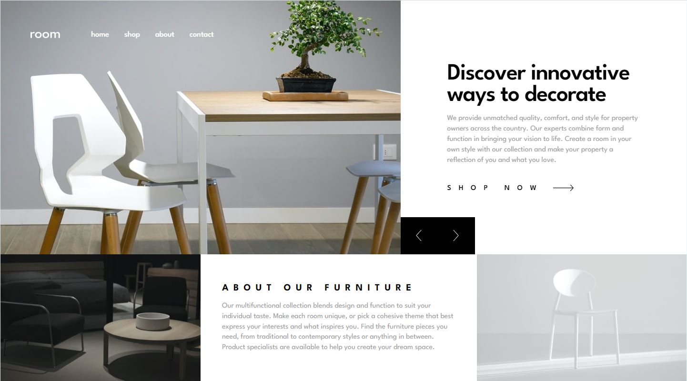

# Frontend Mentor - Room homepage solution

This is a solution to the [Room homepage challenge on Frontend Mentor](https://www.frontendmentor.io/challenges/room-homepage-BtdBY_ENq). Frontend Mentor challenges help you improve your coding skills by building realistic projects. 

## Table of contents

- [Overview](#overview)
  - [The challenge](#the-challenge)
  - [Screenshot](#screenshot)
  - [Links](#links)
- [My process](#my-process)
  - [Built with](#built-with)
  - [What I learned](#what-i-learned)
  - [Continued development](#continued-development)
  - [Useful resources](#useful-resources)
- [Author](#author)

## Overview

### The challenge

Users should be able to:

- View the optimal layout for the site depending on their device's screen size
- See hover states for all interactive elements on the page
- Navigate the slider using either their mouse/trackpad or keyboard

### Screenshot



### Links

- Solution URL: [https://github.com/Yejin-Han/Room-homepage-master](https://github.com/Yejin-Han/Room-homepage-master)
- Live Site URL: [https://yejin-han.github.io/Room-homepage-master/](https://yejin-han.github.io/Room-homepage-master/)

## My process

### Built with

- Flexbox
- Mobile-first workflow
- [Swiper.js](https://swiperjs.com/) - javascript slider library
- [BEM](https://getbem.com/) - Block Element Modifier
- [OOCSS](http://oocss.org/) - Object-Oriented CSS
- [SCSS](https://styled-components.com/) - For styles

### What I learned

I learned how to divide the files in general.

```File Structure
/scss
  /base
    _reset.scss
    _typography.scss
    _index.scss
  /components
    _slide.scss
    _index.scss
  /layout
    _header.scss
    _section-hero.scss
    _section-about.scss
    _index.scss
  /utils
    _variables.scss
    _helpers.scss
    _index.scss
  index.scss
```

And also, I learned the '@use', '@forward' at-rules to import one file into another and finally put it all together in the index.scss file.

### Continued development

It makes sense to subdivide the file structure for large-scale projects, but I thought that it wouldn't be good to subdivide it too much for small-scale projects that generate only one page, like this one(Room-homepage-master). I tried it this time to test it out, but from the next project, if the project has small-scale, I'd like to focus on coding as quickly as possible without using a css pre-processor(SCSS) and with fewer styling files as I'm working on my job.

### Useful resources

- [Resource 1](https://github.com/airbnb/css#oocss-and-bem) - Combination of OOCSS and BEM
- [Resource 2](https://mr-alien.medium.com/use-forward-in-sass-70b9cd44218bm) - @use vs @import, @forward
- [Resource 3](https://stackoverflow.com/questions/14862937/html-image-tag-seems-like-have-some-margin-or-padding) - inline tags have some user agent styles..

## Author

- Github - [Yejin Han(한예진)](https://github.com/Yejin-Han)
- Frontend Mentor - [@Yejin-Han](https://www.frontendmentor.io/profile/Yejin-Han)